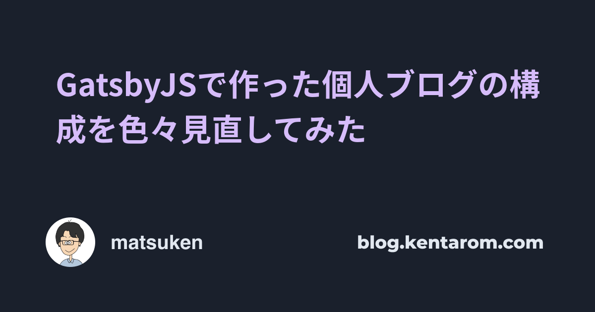

## GatsbyJSで作った個人ブログの構成を色々見直してみた

Kanazawa.js Meetup #11 2021.03.27
[@_kentaro_m](https://twitter.com/_kentaro_m)

---
## 自己紹介


- [@_kentaro_m](https://twitter.com/_kentaro_m)
  - 金沢市内のゲーム会社で働くWeb開発者
  - レガシーシステムを新しくする仕事を担当
  - 最近触っている技術
    - Next.js / GraphQL / Kubernetes / Datadog
---

## 今日話すこと
**GatsbyJSで作った個人ブログのイマイチだと思う部分を改善した点についてお話します。**

*blog.kentarom.com*

---

## 抱えていた課題
- ブログのビルド速度が遅い
- ブログ全体のスタイルに一貫性がない
- マークダウン出力のスタイル適用が力技

---

## ブログのビルド速度が遅い
- Netlifyで4分30秒から5分00秒のビルド時間
  - OGP画像をNode Canvasで動的生成

---

## ブログ全体のスタイルに一貫性なし
- フィーリングでマージンやフォントスタイルを指定
  - スタイル全体に一貫性がない状態
- コンポーネントのカプセル化はされている
  - CSS in JSライブラリのEmotionを利用
  - スタイル変更の影響はコンポーネントにとどまる

---

## ブログ全体のスタイルに一貫性なし
<style scoped>
pre {
  font-size: 24px;
}
</style>

```ts
const BioWrapper = styled.div`
  display: block;
  ${mq[0]} {
    display: flex;
    justify-content: center;
  }
`
const AuthorLink = styled.a`
  font-size: 24px;
  margin-bottom: .2em;
  display: block;
`
const DescriptionText = styled.p`
  font-size: 20px;
  display: block;
  margin: 0;
`
```

---

## マークダウンのスタイル適用が力技
- マークダウンはRemarkプラグインでHTML出力
  - 出力されたHTMLにEmotionでCSSを適用
- HTMLタグの描画でコンポーネントを利用したい
  - 要素指定してCSSを直接定義したくない

---

## マークダウンのスタイル適用が力技
```html
<div
  className='blog-post'
  css={[postStyle]}
  dangerouslySetInnerHTML={{ __html: post.html }}
/>

const postStyle = css`
  h2 {
    font-size: 28px;
    border: none;
    line-height: 1.5;
  }
  /* 省略 */
`
```

---

## 取り組んだ解決策
- OGP画像生成の外部サービス利用
- ブログビルドをGatsby Cloudに変更
- GatsbyJS v3へのアップデート
- Chakra UIの導入
- MDXの導入

---

## OGP画像生成の外部サービス利用
- Node Canvasの画像生成をやめた
  - ビルドが遅くなるため
- Cloudinaryの画像加工機能を利用
  - クラウドベースの画像管理サービス
  - ベース画像に記事タイトルを動的追加

---

## OGP画像生成の外部サービス利用
- URLのパスパラメータの変更で画像生成を制御
  - 記事タイトル
  - フォントスタイル
  - テキスト折返し

<style scoped>
pre {
  width: 75%;
  white-space: pre-wrap;
}
</style>

```
https://res.cloudinary.com/johndoe/image/upload/c_fit,l_text:fontname_64:${encodeURIComponent(title)},co_rgb:D6BCFA,w_1000,y_-100,w_1000/v1616667308/background.png
```
---
## OGP画像生成のサンプル画像
<style scoped>
img {
  width: 60%;
  height: auto;
}
</style>



---
## OGP画像生成のベース画像
- ベース画像にテキストが追加される

<style scoped>
img {
  width: 60%;
  height: auto;
}
</style>


---
# ビルドをGatsby Cloudに変更
- ビルドとホスティングはこれまでNetlifyを利用
- ビルドはGatsby Cloud、ホスティングはVercelに変更
  - デプロイまでの時間が5分00秒から1分30秒に短縮

---
# GatsbyJS v3のアップデート
- GatsbyJS v2からv3にアップデート
  - 変更詳細を追っていないので、ビルド速度向上の直接的な要因が確認できていない

---
# Chakra UIの導入
- 一貫性のあるスタイル適用のためにChakra UI導入
  - Chakra UIコンポーネントベースのレイアウトを心がけた
    - レールからはずれるレイアウト適用は最小限

---
# MDXの導入
- マークダウン描画部分にコンポーネント適用のためにMDX導入
  - HTMLタグと描画させたいコンポーネントをマッピング
    - 良い感じにスタイル適用ができる

---
# MDXの導入
<style scoped>
pre {
  font-size: 24px;
}
</style>

```ts
const components = {
  a: (props) => <Link {...props}>{props.children}</Link>,
  p: ({ children }) => <Text mb={8} lineHeight='tall' >{children}</Text>,
  h2: ({ children }) => <Heading size='lg'>{children}</Heading>,
  ul: ({ children }) => <UnorderedList>{children}</UnorderedList>,
  li: ({ children }) => <ListItem mt={1} mb={1}>{children}</ListItem>,
  pre: (props) => <Box {...props} mb={8} />,
  code: (props) => <CodeBlock {...props} />,
  img: (props) => <Image {...props} mb={8} />,

  <MDXProvider components={components}>
    {data?.mdx?.body}
  </MDXProvider>
}
```

---
## MDXの応用
- [Gatsby Plugin MDX Embed](https://www.gatsbyjs.com/plugins/gatsby-plugin-mdx-embed/)でツイート埋め込み実現
- 自作コンポーネントでSpeaker Deckの埋め込み実現
  - [Speakerdeck の Embed をコンポーネントにして、MDX に埋め込む - ARTICLES](https://kansock.industries/ja/articles/20190426_01/)

```ts
<Tweet tweetLink="yu_kgr/status/1264060189646286850" />
```

---

## 取り組んだ結果
- ビルド高速化を実現
- スタイルに一貫性が生まれた
- マークダウン出力でコンポーネント適用

---

## ブログ執筆環境が快適になりました
次はブログを書くことを頑張ります。

---

## 付録：ソースコード
[github.com/kentaro-m/learn-something-new](https://github.com/kentaro-m/learn-something-new)