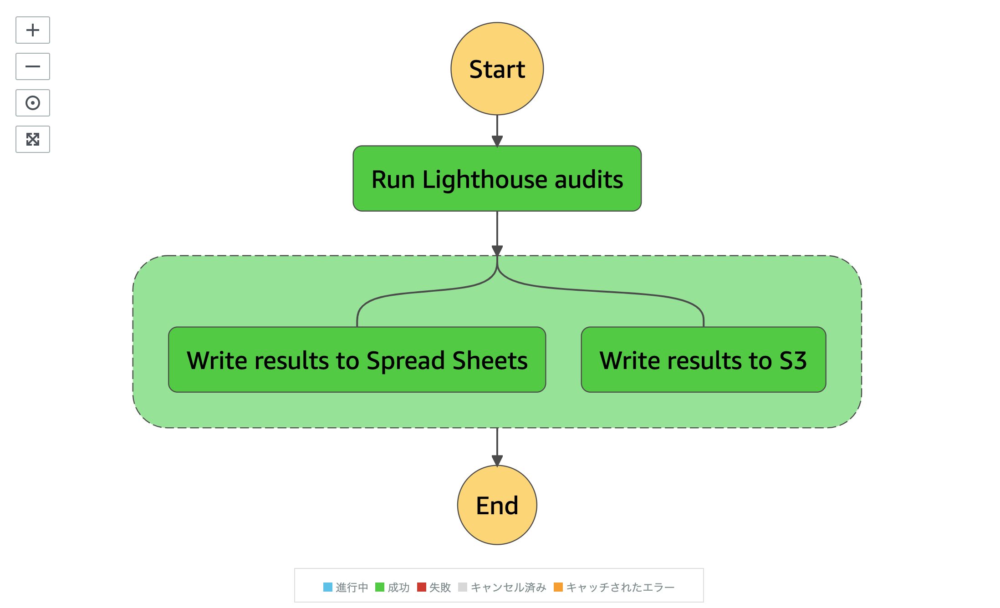
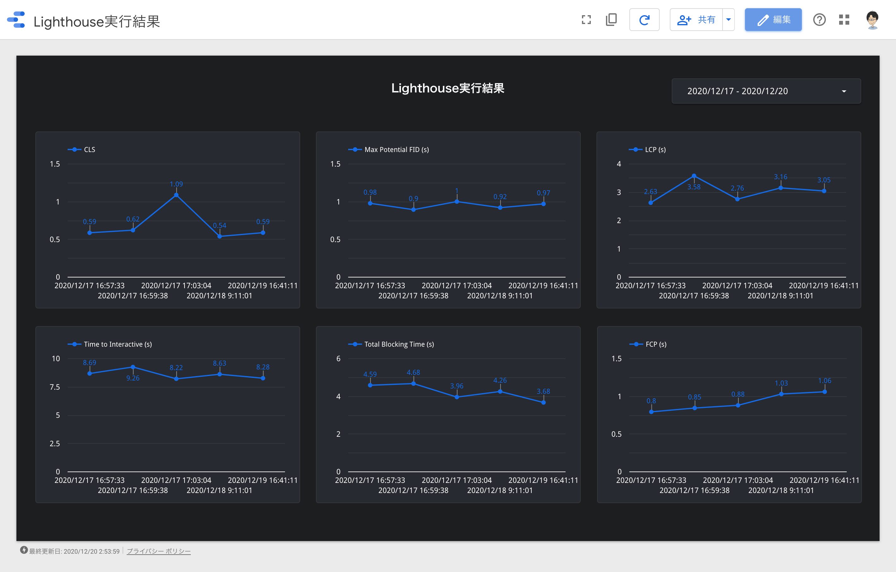

## Webサイトパフォーマンスを継続的に計測したい！！！

Kanazawa.js Meetup #09 2020.12.26
[@_kentaro_m](https://twitter.com/_kentaro_m)

---

## 自己紹介
- [@_kentaro_m](https://twitter.com/_kentaro_m)
  - 金沢市内のゲーム会社で働くフロントエンドエンジニア
  - レガシーなシステムを新しくする仕事をしてます
  - 最近触っている技術
    - Next.js / GraphQL / Kubernetes

---

## 今日話すこと
[Webサイトパフォーマンスを継続的に計測する基盤をサーバーレスアーキテクチャで作った話 - Qiita](https://qiita.com/kentaro_m/items/bf1e2f16edd16dfcf735])
アドベントカレンダーの内容を簡潔に話します。

---

## Q. みなさんの職場ではWebサイトパフォーマンス計測していますか？

---

## A. うちは計測してます
**(但し書きあり)**

---

## A. うちは計測してます
大きなリリースなどの節目のタイミングでは人力で計測
**継続的に計測できていない**

※現状Chrome DevToolsからLighthouse手動実行

---

## 閑話休題：パフォーマンス計測手法
- Synthetic Monitoring
- Real User Monitoring

目的に応じて、使い分ける必要がある。

---

## Synthetic Monitoring

- Synthetic Monitoring
  - 定められた環境からWebサイトにリクエストを送信して、パフォーマンス計測
  - 計測環境はばらつきが少ないが、ユーザー環境との剥離がある可能性
  - ツール例：WebPageTestやLighthouse

---

## Real User Monitoring

- Real User Monitoring
  - ユーザー閲覧環境で何らかの仕組みが実行され、計測サーバーにパフォーマンスが送信される
    - ユーザー環境によって、結果にばらつきが出る
    - ツール例：Datadog RUM

---

## パフォーマンス計測する理由
- パフォーマンスはユーザー体験に大きな影響を与える要素
  - Googleは[Core Web Vitals](https://developers-jp.googleblog.com/2020/05/web-vitals.html)を発表
    - Webサイトのユーザー体験の質を定量的に示す指標
- 自社サイトのユーザー体験改善のために時系列でパフォーマンス変化を分かるようにしたい
  - 継続的に計測しないと良し悪しがわからない


---

## パフォーマンス計測基盤を作ってみる
(アドベントカレンダーのネタにちょうどいい！)

---

## システム要件

- 特定の複数URLに対して、Lighthouseを定期実行
- 実行結果のストレージ保存や外部サービス送信サポート
  - 外部サービスはDatadogやSlackなどを想定
- 何らかのツールを使って、実行結果が可視化できること
  - 各指標ごとにグラフを作れて、時系列で推移が確認できるものをイメージ

---

## システム構成
(画面共有します。図が大きくて収まらなかった...)

---

## 処理フロー
1. 複数のURLのLighthouse実行命令をキューに送信
2. キューからメッセージ受信、ワークフロー呼び出し
3. Lighthouseを実行
4. Lighthouse実行結果を外部サービスに送信

---

## 定期実行管理
- CloudWatch Eventsに登録のcron式ベースで定期実行
- サイトリストベースでLighthouse実行命令をSQSに送信
  - SQSからメッセージ受信し、ワークフロー並列呼び出し

```yaml
sites:
  - title: Foo
    url: https://foo.example.com/
  - title: Bar
    url: https://bar.example.com/
  - title: Baz
    url: https://baz.example.com/
```

---

## Lighthouse実行
- Chromiumをヘッドレス起動、対象URLへLighthouse実行
  - Lambda向けに最適化されたChromiumバイナリ使用
  - Lambdaメモリ割り当て1GB、タイムアウト600秒

---

## 外部サービス連携


---

## 外部サービス連携
- Lighthouseの実行と実行結果の外部サービス連携
  - 実行結果をS3やスプレッドシートへの送信サポート
  - 複数のLambda連携はStep Functionsを利用
    - Lambdaの呼び出し順序や入出力値の調整
      - JSON形式の言語で定義
    - 責務ベースでLambda分割、疎結合な連携を実現
      - Lambdaを増やすと、他のサービスと連携可能

---

## データ可視化


---

## データ可視化
- Data PortalでLighthouse実行結果を可視化
  - 実行結果データセットへBigQueryを実行
- BigQuery Data Transfer ServiceでS3からデータ取り込み
  - 実行結果はJSON形式でS3に保存
  - 1日1回定期実行でBigQueryに取り込み

---

## さいごに
- Lighthouse実行結果の各指標をData Portalで可視化できた
  - まずは今後の改善に向けて、現状把握に利用していきたい
- サーバーレスアーキテクチャでやりたいことが実現できた
  - Lighthouseの並列実行
  - 拡張性を有した外部サービス連携
- [Auto Web Perf](https://github.com/GoogleChromeLabs/AutoWebPerf)というパフォーマンス計測ツールを統合する便利なやつが最近出た
  - これで良いのではという気持ちになっている

---

## パフォーマンス改善の道のりはまだ始まったばかりだ...
終


